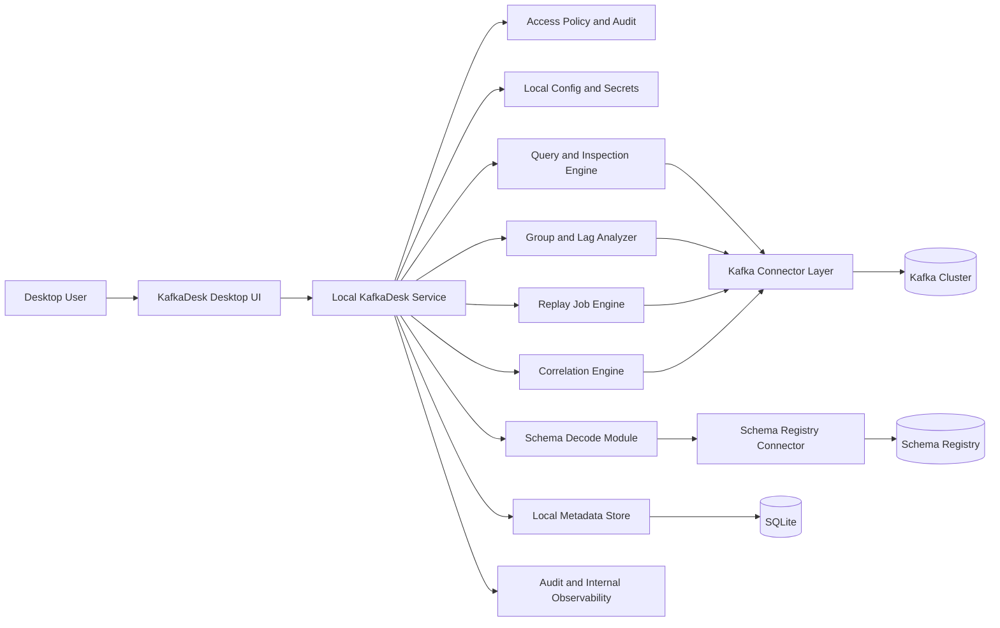
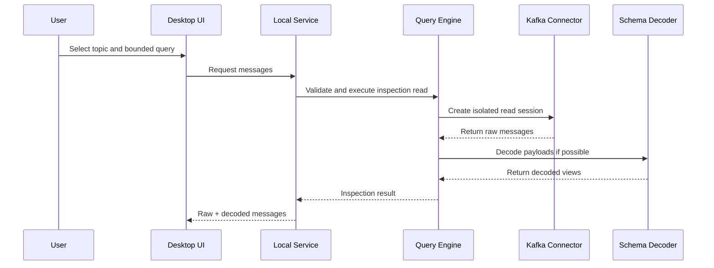
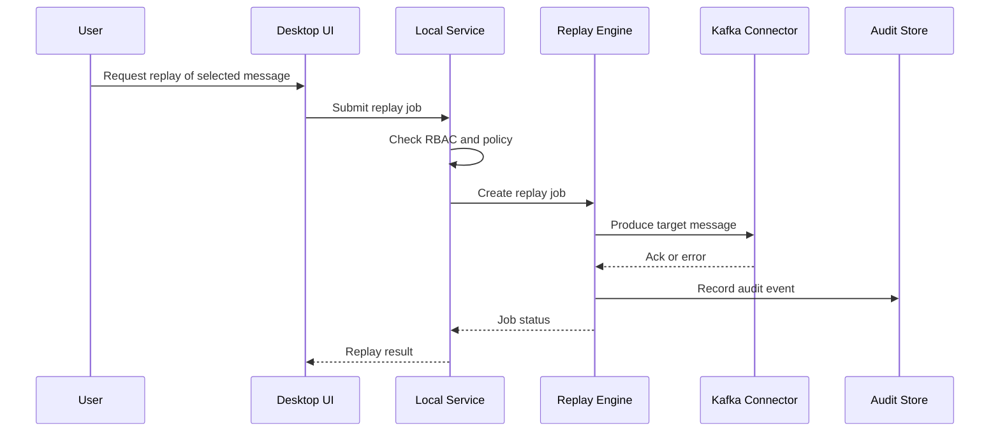

# KafkaDesk Design v0.1

> Historical reference: this document captures early design framing and should not be treated as the current product status page.

## Status

- Stage: Initial concept and architecture draft
- Product name: **KafkaDesk**
- Positioning: Open-source, desktop-first event-stream debugging and visualization workbench
- Primary starting backend: **Kafka-compatible systems**

---

## 1. Requirement Understanding

### 1.1 Problem Statement

Kafka tools exist, but the experience is fragmented.

In practice, teams often split their workflows across:

- a topic/message UI
- a consumer lag tool
- a metrics stack such as Prometheus + Grafana
- a tracing or observability stack
- CLI commands for low-level inspection

This creates friction for developers and platform engineers when debugging real event-driven problems such as:

1. Did a message actually enter the topic?
2. Why is a consumer group lagging?
3. Why was a message skipped, duplicated, or retried?
4. What does the payload actually look like after schema decoding?
5. Can a message be safely replayed?
6. Where did a business event go across multiple topics?

### 1.2 Product Goal

KafkaDesk aims to be a **developer-first workbench** for inspecting, debugging, and managing event flows.

The product should not aim to be “another generic Kafka admin panel.”

It should instead optimize for:

- message visibility
- consumer lag diagnosis
- schema-aware debugging
- replay and test operations
- event-flow tracing by business key or trace key

### 1.3 Target Users

#### Backend Engineers

Need to inspect messages, verify payloads, debug consumers, and replay events safely.

#### Platform / Middleware Engineers

Need to inspect cluster metadata, consumer group health, lag hotspots, and operational safety.

#### QA / Integration Engineers

Need to send test messages, inspect output, validate flows, and reproduce issues.

### 1.4 Product Principles

1. **Prioritize debugging over administration**
2. **Workflow over raw capability lists**
3. **Safe operations over dangerous convenience**
4. **Kafka-first, not Kafka-locked**
5. **Open-source friendly, desktop-first by default**

---

## 2. Ecosystem Context and Product Opportunity

### 2.1 Current Ecosystem Judgment

Kafka visualization tools are **not especially scarce**.

The more accurate judgment is:

> the ecosystem has many tools, but they are fragmented by job-to-be-done.

Representative categories in today’s landscape:

1. **Admin / topic browser UIs**
   - Kafbat UI
   - AKHQ
   - Redpanda Console
   - Confluent Control Center
2. **Consumer lag specialists**
   - Burrow
   - kafka_exporter
   - Kafka Lag Exporter
3. **Metrics dashboards**
   - Kafka JMX + Prometheus + Grafana
4. **Tracing / observability tools**
   - OpenTelemetry-based stacks

### 2.2 Real Gap in the Market

The gap is not “there is no UI.”

The gap is:

- many tools address only one slice of the workflow
- developer workflows still require context switching
- many tools are admin- or ops-shaped rather than debugging-shaped
- replay, schema decoding, message inspection, and event-path reasoning are rarely integrated cleanly
- large-cluster usability, security, and audit are inconsistent across open-source tools

### 2.3 Product Opportunity for KafkaDesk

KafkaDesk should win by focusing on the **debugging workbench** layer.

That means the first versions should optimize for:

- “find the message fast”
- “understand the payload fast”
- “see why the group is unhealthy fast”
- “replay safely”
- “trace a business event path without switching tools”

---

## 3. Scope and Assumptions

### 3.1 In Scope for Initial Product

#### A. Cluster and Topic Visibility

- cluster overview
- topic list
- partition metadata
- topic-level configuration summary

#### B. Consumer Group Visibility

- consumer group list
- lag summary
- partition lag details
- offset inspection

#### C. Message Inspection

- browse messages by topic / partition / offset
- bounded read by time range
- filtering by key and headers
- raw payload view
- decoded payload view

#### D. Schema-Aware Decoding

- JSON
- Avro
- Protobuf
- Schema Registry integration

#### E. Controlled Replay / Test Send

- replay selected message to a target topic
- edit payload, key, and headers before send
- test send workflow
- replay audit trail

#### F. Event Path View

- query by trace key or business key
- correlate messages across topics using configured rules
- render candidate event path / timeline

### 3.2 Out of Scope for First Version

- full APM platform
- full-text global indexing of all Kafka payloads
- enterprise-grade data governance suite
- Flink / Spark job management
- multi-broker support at launch
- fully automatic distributed tracing graph generation

### 3.3 Assumptions

1. First release targets **Kafka-compatible brokers**.
2. Deployment is primarily **desktop-first on the user machine**.
3. Users can supply:
   - bootstrap servers
   - auth configuration
   - optional Schema Registry endpoints
4. Early production usage will likely begin in read-mostly or controlled-ops mode.

---

## 4. Non-Functional Requirements

### 4.1 Usability

- common debugging tasks should complete in a few clicks
- message detail views must remain readable under nested payloads
- the product should favor workflows over raw metadata dumps

### 4.2 Safety

- browsing must not interfere with business consumer groups
- replay must be permission-gated and auditable
- risky actions should require explicit confirmation

### 4.3 Performance

- default queries must be bounded
- large topic browsing must avoid unbounded scans
- lag and metadata pages should remain responsive under medium-to-large cluster sizes

### 4.4 Extensibility

- broker access should be abstracted behind connector interfaces
- codecs and decoders should be pluggable
- event correlation rules should be configurable, not hard-coded

### 4.5 Observability

- the system should emit internal logs, metrics, and audit events
- background operations must expose status and results clearly

---

## 5. Candidate Architecture Options

## Option A: Modular Monolith with Background Jobs

### Summary

One backend service, one frontend application, one metadata database, with internal module boundaries and a lightweight background job subsystem.

### Advantages

- fastest path to MVP
- simplest open-source deployment story
- lower operational burden
- easiest way to validate UX and product direction
- enough structure to split later

### Disadvantages

- long-term scaling limits for indexing-heavy or high-concurrency workloads
- risk of mixing control-plane logic and data-plane workloads if boundaries are not enforced

### Engineering Cost

Low to medium.

### Long-Term Maintenance Impact

Good if modules are kept clean and data-heavy responsibilities are isolated early.

---

## Option B: Split Control Plane and Data Plane

### Summary

Separate services for API/control, Kafka read/query, replay workers, optional indexing, and frontend.

### Advantages

- clearer scaling model
- easier independent tuning of read, write, and indexing workloads
- better long-term fit for enterprise and large-cluster deployments

### Disadvantages

- significantly higher complexity
- slower 0-to-1 progress
- more deployment and operational burden for open-source adopters

### Engineering Cost

Medium to high.

### Long-Term Maintenance Impact

Potentially excellent, but overkill for the first validated version.

---

## Recommendation

Choose **Option A: Modular Monolith with Background Jobs**, applied inside a **desktop-first runtime shape**.

### Decision Basis

KafkaDesk’s first risk is not scale. It is product fit.

The initial goal is to prove that a debugging-first event-stream workbench creates more value than current fragmented workflows.

Therefore the architecture should optimize for:

- delivery speed
- clean UX iteration
- easy local adoption by engineers
- straightforward contribution model for open-source adopters

And at the product-form level it should optimize for:

- direct connectivity from the user machine into internal Kafka environments
- minimal deployment friction
- future extensibility toward optional shared/team mode

The design should still preserve future seams for splitting:

- query engine
- replay workers
- optional indexing / correlation services

---

## 6. Recommended Architecture

### Architectural View

The system has four effective layers:

1. **Presentation layer**
   - desktop shell and renderer UI
2. **Application layer**
   - local service APIs, workflows, policy checks, orchestration
3. **Integration layer**
   - Kafka connector, Schema Registry connector
4. **State and execution layer**
   - local metadata DB, audit records, background jobs

---

## 7. Module Design

### 7.1 Desktop UI Shell

#### Responsibility

- render cluster, topic, group, message, replay, and trace views
- manage filtering, drill-down, and user workflows
- host the desktop shell and application window chrome

#### Upstream Dependencies

- user/desktop environment

#### Downstream Dependencies

- local KafkaDesk service

#### Ownership Boundary

- presentation state only
- no direct Kafka access

---

### 7.2 Local KafkaDesk Service

#### Responsibility

- single local UI entrypoint
- request validation
- local policy enforcement
- orchestration of internal modules

#### Downstream Dependencies

- metadata store
- connector layer
- query engine
- replay engine
- correlation engine

#### Ownership Boundary

- workflow orchestration and policy enforcement

---

### 7.3 Kafka Connector Layer

#### Responsibility

- abstract broker metadata access
- provide message read and produce interfaces
- expose consumer group and offset inspection primitives

#### Ownership Boundary

- broker-specific protocol and client interactions
- isolate Kafka-specific details from upper layers

#### Design Rule

Upper modules should depend on **capabilities**, not raw Kafka client usage.

---

### 7.4 Schema Decode Module

#### Responsibility

- decode payloads using JSON / Avro / Protobuf strategies
- integrate with Schema Registry when configured
- provide raw fallback when decoding fails

#### Ownership Boundary

- payload interpretation only
- not responsible for broker reads

---

### 7.5 Query and Inspection Engine

#### Responsibility

- bounded message reads
- time/offset navigation
- filtering by key/header
- shaping results for UI inspection

#### Ownership Boundary

- debugging-oriented read sessions
- must never reuse business consumer groups

---

### 7.6 Group and Lag Analyzer

#### Responsibility

- fetch consumer group state
- compute lag summaries and partition details
- identify hotspots and suspicious patterns

#### Ownership Boundary

- lag and health analysis, not full metrics monitoring

---

### 7.7 Replay Job Engine

#### Responsibility

- create and execute replay jobs
- support edit-before-send workflow
- provide dry-run and status tracking
- audit all high-risk operations

#### Ownership Boundary

- operational write workflows only

---

### 7.8 Correlation Engine

#### Responsibility

- correlate messages by configured keys
- search candidate event paths across topics
- build event timeline / path views

#### Ownership Boundary

- logical correlation
- not a full distributed tracing system

---

### 7.9 Access Policy, Profiles, and Audit

#### Responsibility

- manage local capability profiles and future managed-mode policy
- authorize sensitive capabilities
- persist audit records for actions

#### Suggested Roles

- **Viewer**: read-only inspection
- **Operator**: controlled replay and test send
- **Admin**: connection, policy, and dangerous operation control

For v1 desktop mode, these roles may initially map to local capability profiles rather than organization-wide identity.

---

### 7.10 Metadata Store

#### Responsibility

- persist control-plane data
- store saved queries, connection definitions, audit records, replay jobs, preferences

#### Important Limitation

By default, the metadata store should **not** become a full payload warehouse.

KafkaDesk is a workbench, not a second Kafka storage layer.

---

## 8. Core Interfaces and Flows

### 8.1 Core Local API Groups

#### Connections / Clusters

- `GET /api/clusters`
- `POST /api/clusters`
- `GET /api/clusters/{id}/overview`

#### Topics

- `GET /api/clusters/{id}/topics`
- `GET /api/clusters/{id}/topics/{topic}`
- `GET /api/clusters/{id}/topics/{topic}/messages`

#### Consumer Groups

- `GET /api/clusters/{id}/groups`
- `GET /api/clusters/{id}/groups/{group}`

#### Replay Jobs

- `POST /api/clusters/{id}/replay-jobs`
- `GET /api/replay-jobs/{jobId}`

#### Correlation / Trace Search

- `POST /api/clusters/{id}/trace-search`
- `GET /api/trace-search/{id}`

---

### 8.2 Message Inspection Flow

---

### 8.3 Replay Flow

---

### 8.4 Event Path Query Flow

1. User submits trace key or business key.
2. Correlation engine resolves configured search scope.
3. Query engine performs bounded reads across candidate topics.
4. Correlation rules link messages by headers, key, or decoded fields.
5. The UI renders a candidate timeline or graph.

---

## 9. Data and State Design

### 9.1 Data Categories

#### Control-Plane Persistent Data

- cluster connections
- local profiles / managed policy metadata when introduced
- saved searches
- replay jobs
- audit events
- correlation rules

#### Live Read Data

- topic metadata
- messages
- offsets
- consumer group state

#### Optional Future Cached / Indexed Data

- lag snapshots
- sampled message cache
- selective correlation indexes

### 9.2 Recommended Storage Strategy

#### Default

- SQLite for simplest local adoption

#### Upgrade Path

- optional later sync/export or managed-mode persistence if team features are introduced

### 9.3 Core Entities

#### ClusterConnection

- id
- name
- bootstrapServers
- authMode
- tlsSettings
- schemaRegistryRef
- tags

#### ReplayJob

- id
- clusterId
- sourceTopic
- sourcePartition
- sourceOffset
- targetTopic
- editedPayload
- editedHeaders
- requestedBy
- status
- createdAt
- completedAt

#### SavedTraceQuery

- id
- clusterId
- queryType
- keyName
- keyValue
- scope
- createdBy

#### AuditEvent

- id
- actor
- action
- target
- outcome
- timestamp

---

## 10. Critical Design Decisions

### Decision 1: No Full Payload Indexing in v1

#### Reason

Full indexing turns the product into a storage-heavy observability platform too early.

#### v1 Approach

- bounded reads
- key/header-based filtering
- time/offset navigation
- selective correlation

---

### Decision 2: Inspection Must Use Isolated Read Sessions

#### Reason

Browsing cannot affect application consumer groups.

#### Rule

- use dedicated inspection sessions
- never reuse production group IDs
- keep inspection state short-lived and bounded

---

### Decision 3: Replay Is a Controlled Operation, Not a Casual Button

#### Reason

Replay can cause duplicate side effects, broken idempotency, and business damage.

#### Rule

- permission-gated
- explicit confirmation
- dry-run support
- audit mandatory
- prefer sandbox replay paths first

---

### Decision 4: Event Path Is Rule-Based First

#### Reason

Kafka itself does not provide business-semantic trace graphs.

#### Rule

- rely on configured correlation keys
- support traceId, orderId, userId, and custom business keys
- label results as inferred/candidate when certainty is limited

---

## 11. Risks and Mitigations

### 11.1 Technical Risk: Interfering with Kafka Usage Patterns

#### Risk

Improper reads or writes could interfere with real workloads.

#### Mitigation

- isolated inspection sessions
- no reuse of application consumer groups
- bounded reads and time limits
- strict operation policies

---

### 11.2 Business Risk: Replay Causes Duplicate Side Effects

#### Risk

Replay may trigger duplicate orders, notifications, or state changes.

#### Mitigation

- sandbox-first workflows
- role-based permissions
- warning-heavy UX
- audit records for all replay jobs

---

### 11.3 Performance Risk: Large Clusters Make UI Unusable

#### Risk

Large clusters and group counts can degrade responsiveness.

#### Mitigation

- bounded queries by default
- pagination and scoped loading
- lag summaries before deep drill-down
- optional future snapshot caching

---

### 11.4 Product Risk: Becoming a Generic Admin Dashboard

#### Risk

The product could drift into feature bloat without a differentiated workflow.

#### Mitigation

- keep debugging workbench as the product center
- prioritize message inspection, replay safety, and event-path reasoning
- defer broad admin/governance features unless they support debugging flows directly

---

### 11.5 Future Evolution Risk: Kafka-Specific Lock-In

#### Risk

Tight Kafka coupling could block broader event-stream support.

#### Mitigation

- abstract broker capabilities behind connector interfaces
- keep transport details in the connector layer
- define decoding and correlation as independent modules

---

## 12. Extensibility and Maintainability Strategy

### 12.1 Connector Model

Future support should be layered via adapters such as:

- `broker-kafka`
- `broker-redpanda`
- `codec-avro`
- `codec-protobuf`
- `schema-registry-confluent`

### 12.2 Configuration Strategy

- connection definitions stored in metadata DB
- secret material referenced securely, not exposed in plain UI payloads
- correlation rules configurable by cluster and topic scope

### 12.3 Backward Compatibility

- API versioning from the start
- avoid encoding UI assumptions into storage schemas without migration support

### 12.4 Observability

KafkaDesk itself should emit:

- structured logs
- internal metrics
- audit events
- background job state

### 12.5 Testing Strategy

- unit tests for codecs, rule engines, and policy checks
- integration tests against Kafka test environments
- workflow tests for message browse, lag view, replay, and correlation
- UI regression coverage for key task flows

---

## 13. Delivery Plan

## Phase 0: Project Skeleton

### Objective

Create a runnable project scaffold and establish core boundaries.

### Deliverables

- desktop shell skeleton
- local service skeleton
- metadata DB initialization
- cluster connection model

### Validation

- local desktop startup works
- one Kafka cluster can be configured and reached

---

## Phase 1: Visibility MVP

### Objective

Make the product useful for basic inspection.

### Deliverables

- cluster overview
- topic list and topic detail
- group list and lag summary
- basic message browser
- JSON decoding support

### Validation

- a user can find a topic, inspect a group, and view messages without CLI

---

## Phase 2: Debugging Workbench Core

### Objective

Move from visibility to debugging utility.

### Deliverables

- Avro/Protobuf decoding
- replay job workflow
- test send flow
- payload diff UI
- audit log for write operations

### Validation

- a user can inspect and replay safely in a controlled environment

---

## Phase 3: Event Path Capabilities

### Objective

Elevate the product from UI viewer to event debugging workbench.

### Deliverables

- correlation rule configuration
- trace/business-key search
- candidate event path view
- saved trace queries

### Validation

- a user can follow a business event across multiple topics using configured keys

---

## Phase 4: Platform Hardening and Extension

### Objective

Improve adoption quality and prepare for broader backend support.

### Deliverables

- managed mode / shared policy hooks
- richer policy surface
- plugin / connector seams
- optional snapshot caching

### Validation

- team deployment quality improves without changing the core product mental model

---

## 14. MVP Definition

If scope must be aggressively constrained, the MVP should be only:

1. cluster connection management
2. topic and partition browsing
3. consumer group and lag view
4. bounded message inspection
5. JSON + schema-aware decoding baseline
6. safe replay to sandbox topic

If these six are implemented well, KafkaDesk already becomes a real debugging tool rather than a concept demo.

---

## 15. One-Sentence Positioning

> **KafkaDesk is an open-source, desktop-first event-stream debugging workbench for inspecting, decoding, replaying, and reasoning about Kafka-based systems.**

---

## 16. Immediate Next Design Steps

This document is sufficient as a v0.1 architecture and product direction draft.

The next design documents should be:

1. **Product design doc**
   - navigation model
   - information architecture
   - primary screens and workflows
2. **Technical design doc**
   - technology stack choice
   - backend module APIs
   - storage schema
   - connector abstraction details
3. **MVP milestone plan**
   - issue breakdown
   - week-by-week delivery slices
