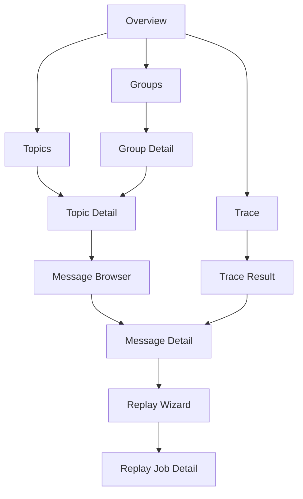

# KafkaDesk Product Design v0.1

> Historical reference: this document preserves early product-design framing and should not be treated as the current product status page.

## Status

- Stage: Initial product design draft
- Companion document: [`traceforge-design.md`](./traceforge-design.md)
- Focus: information architecture, navigation, page design, and user workflows for a desktop-first product

---

## 1. Product Intent

KafkaDesk is not a generic Kafka admin panel.

It is intended to be a **desktop-first developer workbench** for event-stream systems.

The product form assumption in this document is:

> a desktop application shell backed by a local embedded service runtime.

The product should help users answer these questions quickly:

1. What is happening in this topic right now?
2. Why is this consumer group unhealthy?
3. What does this message actually contain after decoding?
4. Can I safely replay or resend this event?
5. Where did this business event go across the system?

### Product Thesis

Unifying fragmented debugging tasks into one coherent workbench creates the most value.

The first versions of KafkaDesk should therefore optimize for:

- speed to insight
- low-friction navigation
- safe operational actions
- debugging-oriented workflows instead of admin-oriented menus

---

## 2. Design Goals

### 2.1 Primary Goals

#### Goal A: Reduce time-to-message

Users should be able to find a topic, locate a relevant message, and inspect it with minimal navigation.

#### Goal B: Reduce time-to-root-cause

Consumer lag, offsets, message contents, headers, schema decoding, and related events should be connected in one flow.

#### Goal C: Reduce context switching

Users should avoid switching between multiple tools for common debugging tasks.

#### Goal D: Make dangerous operations explicit and safe

Replay and send actions should be deliberate, auditable, and controlled.

### 2.2 Secondary Goals

- support large payload readability
- support multi-cluster usage without cognitive overload
- work well for both backend developers and platform engineers
- stay extensible for future broker support

### 2.3 Non-Goals

- replace every monitoring or tracing product
- become a full enterprise governance console in v1
- become a message warehouse or indexing platform in v1

---

## 3. Design Principles

### 3.1 Debugging First

Every major page should answer a debugging question, not merely expose metadata.

### 3.2 Progressive Disclosure

Default views should be compact and legible.

Advanced details should appear through drill-down rather than loading everything at once.

### 3.3 Bounded by Default

All reads and searches should be visibly scoped:

- time range
- partition scope
- result count
- filter scope

This improves safety, performance, and user understanding.

### 3.4 Raw + Interpreted Side by Side

When possible, KafkaDesk should show:

- raw payload
- decoded payload
- headers
- key
- metadata

Users should not be forced into a single interpretation path.

### 3.5 Context Preservation

Once a user has found a message or group, related actions should remain near that context.

Examples:

- inspect message → jump to replay
- inspect group lag → jump to affected topic partitions
- inspect trace result → jump to message detail

### 3.6 Safe Operations Need Friction

Read flows should be fast.

Write-like flows should add deliberate confirmation.

---

## 4. Personas and Core Jobs

## 4.1 Backend Engineer

### Main Jobs

- inspect a suspicious message
- verify payload shape
- find a missing event
- compare expected vs actual message content
- replay to a test or recovery topic

### Design Implications

- message views must be rich and fast
- payload readability matters more than cluster administration depth
- trace-by-business-key is highly valuable

---

## 4.2 Platform / Middleware Engineer

### Main Jobs

- inspect cluster state
- diagnose unhealthy consumer groups
- investigate lag spikes
- understand topic and partition pressure
- guard risky operations

### Design Implications

- group and lag pages must be strong
- cluster overview should provide quick system orientation
- RBAC and audit need visible UX surfaces

---

## 4.3 QA / Integration Engineer

### Main Jobs

- send test messages
- verify system output
- reproduce integration issues
- replay known messages through safe channels

### Design Implications

- replay and test send need simple guided flows
- topic and message lookup should not assume Kafka expertise

---

## 5. Primary User Stories

1. **As a backend engineer**, I want to find a message by key or time window so I can verify whether the producer emitted the expected event.
2. **As a platform engineer**, I want to inspect a consumer group’s lag distribution so I can identify whether the issue is broad or isolated to specific partitions.
3. **As a backend engineer**, I want to decode Avro/Protobuf payloads so I can understand actual business fields instead of raw bytes.
4. **As an operator**, I want to replay a message to a sandbox topic with audit logging so I can re-run flows safely.
5. **As a user debugging a business incident**, I want to trace an orderId or traceId across topics so I can see where the event stopped or diverged.

---

## 6. Product Surface Model

The product should have a simple mental model:

1. **Orient** — what cluster/system am I looking at?
2. **Inspect** — what topic, group, or message is relevant?
3. **Diagnose** — what is wrong or suspicious?
4. **Act** — replay, send, or save a query
5. **Trace** — follow the event path

This model implies that the top-level navigation should not be organized around internal backend modules.

It should be organized around user tasks.

---

## 7. Information Architecture

## 7.1 Global Navigation

Recommended primary left navigation:

1. **Overview**
2. **Topics**
3. **Groups**
4. **Messages**
5. **Replay**
6. **Trace**
7. **Saved Queries**
8. **Audit**
9. **Settings**

### Why this order

- **Overview** gives orientation
- **Topics** and **Groups** cover the most common read/debug entry points
- **Messages** supports direct debugging work
- **Replay** and **Trace** are higher-order workflows
- **Saved Queries**, **Audit**, and **Settings** are secondary but important

## 7.2 Global Header

The top header should contain:

- current cluster selector
- environment badge (dev / test / staging / prod)
- quick search
- recent items
- user menu

### Header Purpose

The header should support fast context switching without overwhelming the page body.

## 7.3 Global Search

Quick search should support at minimum:

- topic name
- consumer group name
- saved query name
- trace key shortcut

It should not pretend to be a full payload search engine in v1.

---

## 8. Primary Navigation Model

### Interpretation

There are three main entry paths:

1. **Cluster-first path**
   - Overview → Topics / Groups → drill-down
2. **Message-first path**
   - Messages → browser → detail → replay / trace
3. **Incident-first path**
   - Trace → result → message detail / group / topic context

---

## 9. Key Screens

## 9.1 Overview Page

### Purpose

Provide fast cluster orientation and highlight active debugging entry points.

### Core Sections

1. Cluster summary
   - cluster name
   - broker count
   - environment label
   - schema registry status
2. Topic summary cards
   - total topics
   - active topics
   - topics with recent anomalies if available
3. Consumer group health summary
   - healthy groups
   - lagging groups
   - highest lag groups
4. Recent activity
   - recent replay jobs
   - recent trace searches
   - recent saved queries
5. Quick actions
   - browse messages
   - search trace key
   - open lagging groups

### Design Notes

- This page should not become an overloaded dashboard.
- It should behave like an orientation and launch surface.

---

## 9.2 Topics List Page

### Purpose

Provide a compact, filterable list of topics and their debugging relevance.

### Columns

- topic name
- partition count
- replication factor
- message retention summary
- latest activity indicator (if available)
- schema presence indicator

### Filters

- text search
- internal topics toggle
- favorites only
- unhealthy only (future)

### Actions

- open topic detail
- favorite topic
- copy topic name

### Design Notes

- keep density high but readable
- do not overload with every Kafka config by default

---

## 9.3 Topic Detail Page

### Purpose

Show topic-level context and provide the launch point for message inspection.

### Sections

1. Topic summary bar
   - topic name
   - partitions
   - retention summary
   - schema indicator
2. Partition table
   - partition id
   - earliest offset
   - latest offset
   - leader / replica status
3. Related consumer groups
   - groups consuming this topic
   - lag summary per group
4. Topic actions
   - browse messages
   - open trace with this topic preselected

### Design Notes

- topic metadata should support debugging, not become a raw config dump
- advanced config can live in a collapsible section

---

## 9.4 Groups List Page

### Purpose

Help users quickly find lagging or suspicious consumer groups.

### Columns

- group name
- state
- total lag
- partition count
- topic count
- last seen / status indicator

### Filters

- lagging only
- text search
- topic scoped filter

### Sorting

- total lag desc
- group name
- state

### Design Notes

- this page must support “what is currently wrong?” workflows
- lag and state should be visually stronger than generic metadata

---

## 9.5 Group Detail Page

### Purpose

Provide the main lag diagnosis surface.

### Sections

1. Group summary
   - state
   - total lag
   - assigned partitions
2. Lag breakdown
   - topic-level lag
   - partition-level lag
3. Offset and activity detail
   - committed offset
   - log end offset
   - lag delta
4. Debug entry points
    - open affected topic
    - browse lagging partition messages
    - reset consumer offsets in a controlled flow
    - save this view as a query

### Design Notes

- the core job is to move from lag summary to affected message space quickly
- avoid making users manually cross-reference topic + partition + group views
- offset reset should feel like a deliberate recovery action, not a casual editing feature

---

## 9.6 Messages Page

### Purpose

Offer a direct entry point into message debugging without forcing users through topic detail first.

### Query Panel Inputs

- cluster
- topic
- partition (optional)
- time range or offset range
- key filter
- header filter
- max results

### Result Table Fields

- timestamp
- partition
- offset
- key preview
- header count
- payload preview
- decode status

### Design Notes

- this is one of the most important pages in the product
- the query builder must remain compact and understandable
- all queries must be visibly bounded

---

## 9.7 Message Detail Page

### Purpose

Provide a complete, usable debugging surface for one message.

### Layout Recommendation

Use a two-column or tabbed structure:

#### Left / Primary

- decoded payload
- raw payload
- payload diff support when relevant

#### Right / Secondary

- topic / partition / offset metadata
- timestamp
- key
- headers
- schema information
- replay and trace actions

### Tabs or Sections

1. **Decoded**
2. **Raw**
3. **Headers**
4. **Metadata**
5. **Related Events** (future / conditional)

### Actions

- replay message
- send modified copy
- open trace using selected key/header
- copy raw JSON / payload
- bookmark message

### Design Notes

- readability is critical
- nested JSON/Avro/Protobuf views need folding and copy support
- decoding failure should not be a dead end
- message deletion or truncation is not a normal message-detail action

---

## 9.8 Replay Page

### Purpose

Guide users through a controlled replay workflow.

### Replay Should Not Be a Single Blind Button

It should be a mini-wizard with explicit steps.

### Suggested Steps

1. Source confirmation
   - source topic / partition / offset
   - preview source payload
2. Target selection
   - target cluster/topic
   - sandbox recommendation
3. Mutation step
   - edit key
   - edit headers
   - edit payload
4. Risk check
   - permission reminder
   - warning text
   - dry-run if available
5. Confirm and execute

### Replay Job Result View

- status
- execution time
- target topic
- produced record summary
- audit entry reference

### Design Notes

- make risky operations feel intentional
- users should understand exactly what will be sent

---

## 9.9 Trace Page

### Purpose

Let users follow a business event or technical trace across topics.

### Inputs

- trace key type
  - traceId
  - orderId
  - userId
  - custom field
- value
- cluster
- topic scope
- time range

### Output Modes

1. Timeline view
2. Graph / path view
3. Table view

### Result Content

- candidate related events
- inferred path ordering
- link to message details
- confidence or inference indicator if applicable

### Design Notes

- be explicit when correlation is inferred rather than authoritative
- avoid pretending this is a universal tracing engine

---

## 9.10 Saved Queries Page

### Purpose

Support repeat debugging workflows.

### Use Cases

- favorite topic searches
- recurring lag investigations
- repeated trace lookups for known business flows

### Fields

- query name
- query type
- cluster
- last run time
- owner

---

## 9.11 Audit Page

### Purpose

Expose write-like activity and sensitive operations.

### Main Content

- replay actions
- controlled offset-reset actions
- test sends
- configuration changes
- permission-sensitive events
- high-risk admin operations when present

### Fields

- actor
- action
- target
- outcome
- timestamp

### Design Notes

- this page is especially important for production or shared environments

---

## 9.12 Settings Page

### Purpose

Manage cluster connections, decoding settings, correlation rules, and security preferences.

### Sections

- cluster connections
- auth / role mapping
- schema registry settings
- correlation rule configuration
- environment labels and danger modes
- controlled offset-reset policy defaults

---

## 10. Core Workflows

## 10.1 Workflow: Find a Missing Event

### User Goal

Determine whether an expected event was produced and where it stopped.

### Recommended Flow

1. Enter Messages or Trace page
2. Search by topic + key or trace key
3. Open message detail
4. Inspect decode result and metadata
5. Jump to trace result or related events
6. If needed, inspect affected consumer group

### UX Requirement

The user should not have to manually rebuild context across unrelated pages.

---

## 10.2 Workflow: Diagnose Consumer Lag

### User Goal

Understand which group or partition is behind and why.

### Recommended Flow

1. Open Groups page
2. Sort by lag desc
3. Open group detail
4. Inspect topic/partition lag breakdown
5. Jump to affected topic and browse nearby messages
6. Save query if this investigation recurs

### UX Requirement

Lag diagnosis must naturally connect group view to message inspection.

---

## 10.3 Workflow: Replay a Known Message

### User Goal

Re-run a message through a safe path.

### Recommended Flow

1. Open message detail
2. Click replay
3. Confirm source
4. Select target topic
5. Optionally edit payload/headers
6. Confirm risk warning
7. Execute and review replay job result

### UX Requirement

Users must feel informed and protected before execution.

---

## 10.4 Workflow: Trace a Business Incident

### User Goal

Follow a business key across multiple topics.

### Recommended Flow

1. Open Trace page
2. Enter business key and scope
3. View timeline / path
4. Open suspicious message detail
5. Compare decoded payloads
6. If needed, replay or save trace query

---

## 11. Interaction Patterns

## 11.1 Drill-Down Pattern

Every summary page should support this pattern:

summary list → focused detail → actionable next step

Examples:

- Groups → Group Detail → Message Browser
- Topics → Topic Detail → Message Browser
- Trace Result → Message Detail → Replay

## 11.2 Contextual Action Pattern

Actions should appear close to the inspected entity.

Examples:

- message detail shows replay / trace actions
- group detail shows open affected partitions
- topic detail shows browse messages

## 11.3 Safe Action Pattern

All write-like actions should use:

- explicit target naming
- visible environment badge
- preview before execute
- audit notice

---

## 12. States and Edge Cases

## 12.1 Empty States

### Good Empty States Should Help Users Start

Examples:

- no clusters configured → show connection setup CTA
- no saved queries → suggest saving common investigations
- no trace result → explain scope and offer filter tips

## 12.2 Error States

Errors should be specific and actionable.

Examples:

- auth failure to broker
- schema decode failure
- read window too broad
- replay denied by permission policy

### Error Design Rule

Do not show opaque backend errors without interpretation.

## 12.3 Loading States

Loading states should communicate scope.

Examples:

- “Loading messages from topic X, partition Y, last 15 minutes”
- “Calculating lag for 128 partitions”

This builds trust and reduces confusion.

---

## 13. Permission Model in UX

Different roles should see different affordances.

### Viewer

- can inspect clusters, topics, groups, and messages
- cannot replay or send

### Operator

- can perform controlled replay and test send in allowed scopes
- can perform controlled offset resets in allowed scopes where policy permits

### Admin

- can manage connections, rules, controlled offset resets for privileged scopes, and high-risk operations such as delete-records/truncation

### UX Rule

Unavailable actions should be either:

- hidden when irrelevant
- disabled with clear explanation when educational value matters

---

## 14. Visual Design Direction

This document does not define final UI style, but it should define product tone.

### Desired Tone

- technical
- crisp
- calm
- high-information density without clutter
- trustworthy for operational work

### Avoid

- consumer-app style fluff
- oversized cards everywhere
- dashboard theater without workflow value
- color noise that hides meaning

### Visual Heuristics

- use color strongly for status and risk, not decoration
- support monospace where message content matters
- support folding, diff views, and copy actions generously

---

## 15. MVP Product Cut

If the product surface must be constrained for v1, the highest-value screens are:

1. Overview
2. Topics List
3. Topic Detail
4. Groups List
5. Group Detail
6. Messages Page
7. Message Detail
8. Replay Flow

### Can Be Deferred

- graph-heavy trace visualization
- rich saved query management
- advanced audit exploration
- multi-broker abstraction surfaces in UI

### Minimal Compelling Workflow Set

The MVP should already support:

1. inspect topic
2. inspect lagging group
3. inspect message
4. decode payload
5. replay to sandbox

If these work well, the product has immediate value.

---

## 16. Product Metrics

The product should eventually optimize for measurable outcomes such as:

- time from landing to first useful message inspection
- time to identify lagging group cause
- replay completion success rate
- number of repeated saved debugging workflows
- reduction in CLI-only incident investigation steps

---

## 17. Product Risks

### Risk A: The Product Becomes a Generic UI Clone

#### Mitigation

Keep message inspection, replay safety, and trace workflows at the center.

### Risk B: The Product Feels Powerful but Slow

#### Mitigation

Use bounded defaults and optimize navigation paths before adding more capability.

### Risk C: The Product Overpromises “Tracing”

#### Mitigation

Use clear language such as “candidate event path” and “rule-based correlation.”

### Risk D: Too Much Operational Friction

#### Mitigation

Keep read flows fast; reserve friction for risky actions only.

---

## 18. Design Recommendations for the Next Iteration

The next product-design artifacts should be:

1. page-by-page wireframe outlines
2. navigation and breadcrumb rules
3. detailed message detail layout spec
4. replay wizard UX spec
5. trace page result model spec

---

## 19. One-Sentence Product Positioning

> **KafkaDesk is a debugging-first workbench for inspecting, tracing, and safely operating Kafka-based event systems.**
